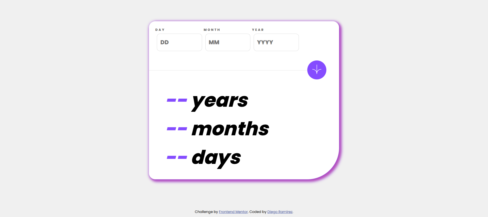

# Frontend Mentor - Tip calculator app solution

This is a solution to the [Tip calculator app challenge on Frontend Mentor](https://www.frontendmentor.io/challenges/tip-calculator-app-ugJNGbJUX). Frontend Mentor challenges help you improve your coding skills by building realistic projects.

## Table of contents

- [Overview](#overview)
  - [The challenge](#the-challenge)
  - [Screenshot](#screenshot)
  - [Links](#links)
- [My process](#my-process)
  - [Built with](#built-with)
  - [What I learned](#what-i-learned)
  - [Continued development](#continued-development)
- [Author](#author)

## Overview

### The challenge

Users should be able to:

- View the optimal layout for the app depending on their device's screen size
- See hover states for all interactive elements on the page
- Calculate the correct tip and total cost of the bill per person

### Screenshot



### Links

- Solution URL: [Github](https://github.com/Diego2Drm/age-calculator-app-main)
- Live Site URL: [age-calculator-app-main](https://diego2drm.github.io/age-calculator-app-main/) 

## My process

### Built with

- Semantic HTML5 markup
- CSS custom properties
- Flexbox
- Mobile-first workflow

### What I learned

learned to work with JavaScript dates

``` js
function calculateAge(birthYear, birthMonth, birthDay) {

  if (!isValidDate(birthYear, birthMonth, birthDay)) {
    errorValidDate(birthDay, "labelDay")
    errorValidDate(birthMonth, "labelMonth")
    errorValidDate(birthYear, "labelYear")
    if (birthDay > 0) {
      let labelDay = document.getElementById("labelDay");
      labelDay.lastElementChild.classList.remove("hidden")
      labelDay.lastElementChild.classList.add("show")
    }
    return console.log("La fecha ingresada no es válida.");
  }

  const birthDate = new Date(birthYear, birthMonth - 1, birthDay);
  const currentDate = new Date();

  let ageYears = currentDate.getFullYear() - birthDate.getFullYear();
  let ageMonths = currentDate.getMonth() - birthDate.getMonth();
  let ageDays = currentDate.getDate() - birthDate.getDate();

  if (ageDays < 0) {
    const previousMonth = new Date(currentDate.getFullYear(), currentDate.getMonth(), 0);
    ageDays += previousMonth.getDate();
    ageMonths--;
  }

  if (ageMonths < 0) {
    ageMonths += 12;
    ageYears--;
  }

  let yearsResult = document.getElementById("yearsResult")
  let monthResult = document.getElementById("monthResult")
  let daysResult = document.getElementById("daysResult")

  yearsResult.innerText = ageYears;
  monthResult.innerText = ageMonths;
  daysResult.innerText = ageDays;
}
```

### Continued development

- Dates in JavaScript()

## Author

- Website - [Diego Ramírez](https://diego2drm.github.io/Portafolio/)
- Frontend Mentor - [@Diego2Drm](https://www.frontendmentor.io/profile/Diego2Drm)
- Gmail - [diego.ramirez2d03@gmail.com]